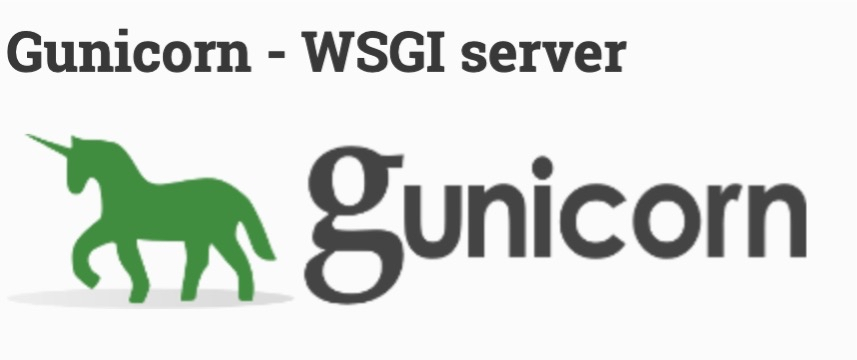

# gunicorn

## 简介

[Gunicorn](https://docs.gunicorn.org/en/stable/index.html) 全称是 Green unicorn，它是一个适用于 UNIX 的 Python WSGI HTTP 服务器。
Gunicorn 服务器与各种 web 框架广泛兼容，实现简单，服务资源少，速度相当快。

特性：

* 原生支持 `WSGI`, `Django`, `Paster`
* 自动管理工作进程
* 简单的 Python 配置
* 多个工作器配置
* 可拓展的各种服务挂钩(Sever hook)
* 兼容 Python 3.5 以上版本
