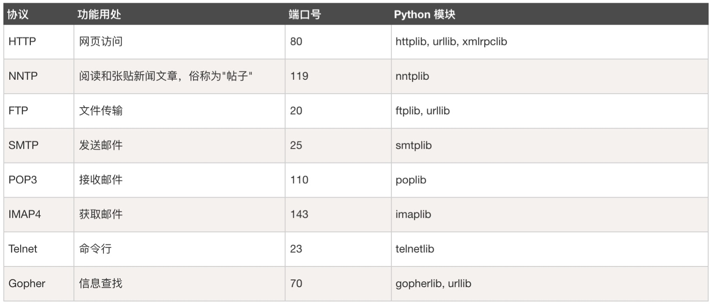
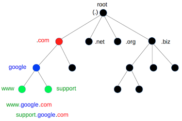

# 网络与Web编程

* 使用 Python 编写客户端程序来访问已有的服务
* 使用 Python 实现网络服务端程序

## 1 URL 简介

URL (Uniform Resource Locator) : 统一资源定位器。它是 `www` 页的地址，它的组成包括：

* Internet 资源类型 (`scheme`)：指出 `www` 客户程序用来操作的工具。如`http`表示`www`服务器，`ftp`表示`FTP`服务器；
* 服务器地址(`host`) ：指出 `www` 页所在的服务器域名；
* 端口 (`port`) ：对某些资源的访问，需给相应的服务器提供端口号；
* 路径 (`path`) ：指出服务器上某资源的位置。格式与DOS系统中的格式一样，通常有 `目录/子目录/文件名` 这样的结构组成。

> URL 的格式为：`scheme://host:port/path`

## 2 DNS

DNS (Domain Name System) : 域名系统。主机到IP的转换通常要经过DNS查询，DNS是一个庞大的分布式数据库，
它将主机名组织在一个层级的空间中，一个节点的域名由该节点到根的路径所有节点组成的名字连接而成。

## 3 Python urlib

## 参考

* [URL 详解](https://zhuanlan.zhihu.com/p/71374158)
* [RUNOOB - Python urllib](https://www.runoob.com/python3/python-urllib.html)
* [Python 官方文档 urllib - URL 处理模块](https://docs.python.org/zh-cn/3.6/library/urllib.html)
