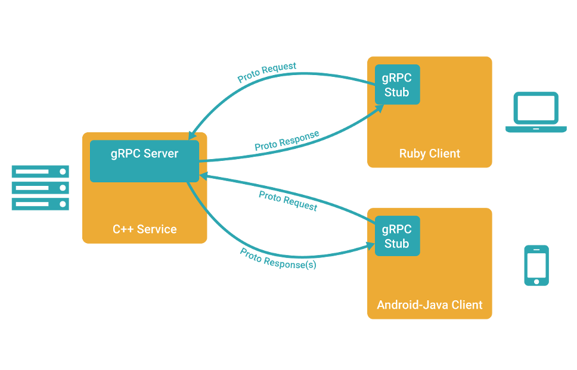

# gRPC

## 1 简介

`gRPC` (Google RPC) 是`Google`发起的一个开源`RPC`系统。
该系统基于`HTTP/2`协议传输，使用`protobuf`作为接口描述语言。

在`gRPC`里，客户端可以像调用本地对象一样，
直接调用另一台不同机器上服务端应用的方法，使得你能够更容易地创建分布式应用和服务。

`gRPC`的理念：定义一个服务，指定其能够被远程调用的方法(包括：参数、返回类型)。
在服务端实现这个接口，并运行一个`gRPC`服务器来处理客户端调用。
在客户端拥有一个存根，能够像服务端一样的方法。



## 2 远程过程调用 - RPC

远程过程调用 (`Remote Procedure Call`，缩写为 `RPC`) 是一个计算机通信协议。
该协议允许运行于一台计算机的程序调用另一个地址空间的子程序，
而程序员就像调用本地程序一样，无需额外地为这个交互作用编程。

`RPC`是一种客户端-服务器(`Client/Server`)模式，
经典实现是一个通过`发送请求 - 接受回应`进行信息交互的系统。

`RPC`是一种进程间通信的模式，程序分布在不同的地址空间中：

* 在同一主机里，`RPC`可通过不同的**虚拟地址空间**进行通讯；
* 在不同主机里，`RPC`可通过不同的**物理地址**进行通讯；

### 2.1 RPC 中的信息传递

RPC（Remote Procedure Call）远程过程调用，简单的理解是一个节点请求另一个节点提供的服务：

* 首先客户端需要告诉服务器，需要调用的函数，这里函数和进程ID存在一个映射，客户端远程调用时，需要查一下函数，找到对应的ID，然后执行函数的代码。
* 客户端需要把本地参数传给远程函数，本地调用的过程中，直接压栈即可，但是在远程调用过程中不在同一个内存里，无法直接传递函数的参数，因此需要客户端把参数转换成字节流，传给服务端，然后服务端将字节流转换成自身能读取的格式，是一个序列化和反序列化的过程。
* 数据准备好了之后，如何进行传输？网络传输层需要把调用的ID和序列化后的参数传给服务端，然后把计算好的结果序列化传给客户端，因此TCP层即可完成上述过程，`gRPC`中采用的是`HTTP2`协议。


* 1. 客户端调用(CLient Functions)，这个调用是在本地，并将客户端提供的调用参传送到**CLient stub**；
* 2. **CLient stub**包装这些参数，打包的过程称为 `marshalling`，常见方式：`XML`、`JSON`、`二进制编码`；
* 3. 客户端本地操作系统发送信息到服务器（可通过自定义`TCP协议`或`HTTP`传输）；
* 4. 服务器系统将信息传送到 **Server stub**；
* 5. **Server stub** 解析信息，解析的过程称为`unmarshalling`；
* 6. **Server stub** 调用程序(Server Function)，将处理结果传送回 **Server stub**；
* 7. **Server stub** 包装这些参数；
* 8. 服务器发送信息到客户端
* 9. 客户端将信息传送到 **Client stub**
* 10. **Client stub** 将结果返回给 `Client Functions`

## 3 gRPC - Python Demo

### 3.1 protobuf 安装

到[protobuf Release](https://github.com/protocolbuffers/protobuf/releases)中
下载最新的`protoc-*-osx-x86_x64.zip` ：

```shell
wget https://github.com/protocolbuffers/protobuf/releases/download/v3.17.0/protoc-3.17.0-osx-x86_64.zip
```

解压，拷贝到`$PATH`下：

```shell
unzip protoc-3.17.0-osx-x86_64.zip -d protoc-3.17.0
cd protoc-3.17.0
sudo cp -r include/ /usr/local/include/
sudo cp -r bin/ /usr/local/bin/
```

测试：

```shell
protoc
```

### 3.2 定义服务

一个 `RPC` 服务通过**参数**和**返回类型**来指定可以远程调用的方法。

`gRPC` 通过 `protocol buffers`定义：

* 服务方法
* 参数
* 返回类型

```proto
// helloworld.proto
syntax = "proto3";

package helloworld;

// The greeting service definition.
service Greeter {
  // Sends a greeting
  rpc SayHello (HelloRequest) returns (HelloReply) {}
}

// The request message containing the user's name.
message HelloRequest {
  string name = 1;
}

// The response message containing the greetings
message HelloReply {
  string message = 1;
}
```

简单分析：`Greeter` 服务有一个方法 `SayHello`，
可以让服务端从远程客户端接受一个`HelloRequest`消息后，在一个`HelloReply`里发送回一个`Greeter`；

### 3.3 生成 `gRPC`的Python代码

调用`protoc`命令编译生成：

```shell
protoc -I=. --python_out=. ./helloworld.proto
```

`protoc`编译命令解析：

* `-I` ：指定编译源文件所在的目录；
* `--python_out` ：指定生成 `*_pb2.py` 文件的路径；

上述生成的`helloworld_pb2.py`中包含了类`Request`和类`Reply`的定义。
如果要生成`grpc`的客户端`client`类和服务端`server`类的代码，需执行：

```shell
python -m grpc_tools.protoc -I=. --grpc_python_out=. ./helloworld.proto
```

* 执行此命令，需先`pip`安装`grpcio`和`grpcio-tools`。
* 执行命令`python -m grpc_tools.protoc`将生成`*_pb2_grpc.py`文件，此文件中包含了客户端(`client`)类和服务端(`server`)类的定义。

### 3.4 写一个服务器

```python
# coding=utf-8
from concurrent import futures
import logging
import grpc

import helloworld_pb2
import helloworld_pb2_grpc


class Greeter(helloworld_pb2_grpc.GreeterServicer):
    """定义服务类，最好与 .proto 中定义的保持一致"""
    def SayHello(self, request, context):
        """服务类的函数

        request : 请求
        context : 上下文
        """
        return helloworld_pb2.HelloReply(message="Hello, %s!" % request.name)


def serve():
    # 以异步执行的多线程并发方式创建一个 grpc 服务，线程池的阈值是10
    server = grpc.server(futures.ThreadPoolExecutor(max_workers=10))
    # 部署服务
    helloworld_pb2_grpc.add_GreeterServicer_to_server(Greeter(), server)
    # 设置服务的端口为 50051
    server.add_insecure_port('[::]:50051')
    # 启动服务
    server.start()
    # 等待结束
    server.wait_for_termination()


if __name__ == "__main__":
    logging.basicConfig()
    serve()
```

### 3.5 写一个客户端

```python
 # coding=utf-8
from __future__ import print_function
import logging
import grpc
import helloworld_pb2
import helloworld_pb2_grpc


def run():
    # grpc.insecure_channel 创建通信连接
    with grpc.insecure_channel('localhost:50051') as channel:
        # 创建 stub
        stub = helloworld_pb2_grpc.GreeterStub(channel)
        # 创建 request 实例
        request = helloworld_pb2.HelloRequest(name='you')
        # 根据 stub，调用服务函数
        response = stub.SayHello(request)
    # 打印返回的结果
    print("Greeter client received: ", response.message)


if __name__ == "__main__":
    logging.basicConfig()
    run()
```

## gRPC 的应用

`gRPC` 通过可插拔的支持来有效地连接数据中心和跨数据中心的服务，
以实现负载均衡、跟踪、运行状况检查和身份验证。
`gRPC`也适用于分布式计算的最后一英里，以将设备、移动应用程序和浏览器连接到后端服务。

`gRPC`最常见的应用场景：

* 微服务框架下，多种语言服务之间的高效交互；
* 将手机服务、浏览器连接至后台；(gRPC基于`HTTP/2`标准设计，带来诸如双向流、流控、头部压缩、单TCP连接上的多复用请求等。这些特性使得其在移动设备上表现更好，更省电和节省空间占用)
* 产生高效的客户端库；

## 参考

* [维基百科 - RPC](https://zh.wikipedia.org/wiki/%E9%81%A0%E7%A8%8B%E9%81%8E%E7%A8%8B%E8%AA%BF%E7%94%A8)
* [维基百科 - 分布式计算](https://zh.wikipedia.org/wiki/%E5%88%86%E5%B8%83%E5%BC%8F%E8%AE%A1%E7%AE%97)
* [维基百科 - 客户端-服务器](https://zh.wikipedia.org/wiki/%E4%B8%BB%E5%BE%9E%E5%BC%8F%E6%9E%B6%E6%A7%8B)
* [GitHub - gRPC](https://github.com/grpc/grpc)
