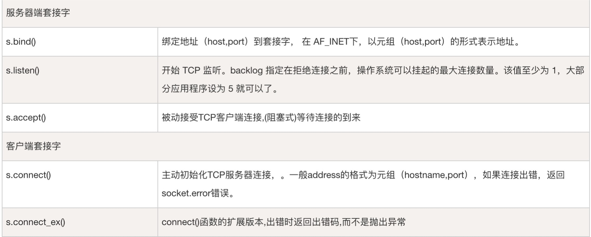
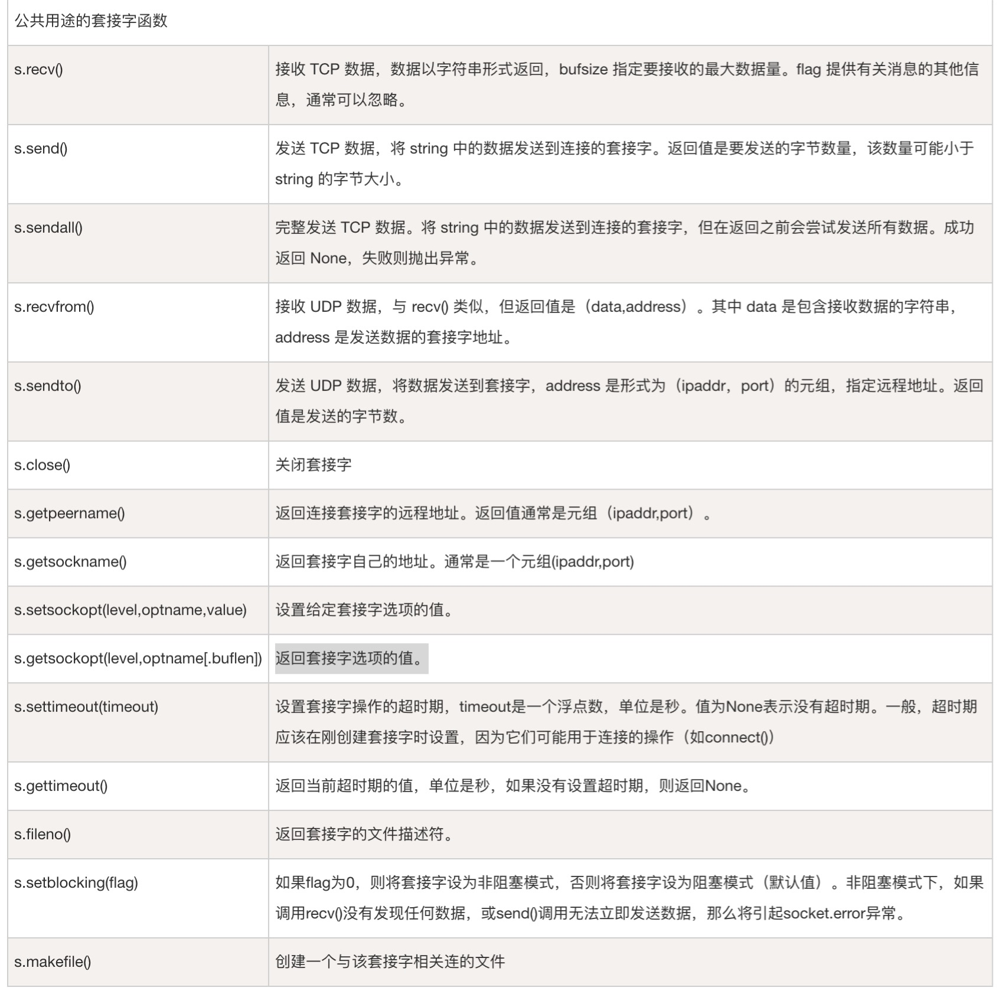

# Python 网络编程

## socket 简介

Python 提供了两个级别访问的网络服务：

* 低级别的网络服务支持基本的 `Socket`，它提供了标准的 BSD Sockets API，可以访问底层操作系统 `Socket` 接口的全部方法。
* 高级别的网络服务模块 `SocketServer`， 它提供了服务器中心类，可以简化网络服务器的开发。

### 什么是 socket ?

Socket又称"套接字"，应用程序通常通过"套接字"向网络发出请求或者应答网络请求，
使主机间或者一台计算机上的进程间可以通讯。

### socket()函数

Python 中，我们用 socket（）函数来创建套接字，语法格式如下：

```python
socket.socket([family[, type[, proto]]])
```

参数

* `family` : 套接字家族可以是 `AF_UNIX` 或者 `AF_INET`
* `type` : 套接字类型可以根据是面向连接的还是非连接分为 `SOCK_STREAM` 或 `SOCK_DGRAM`
* `protocol` : 一般不填默认为 `0`

### socket 对象的方法





## socket 示例

服务端

```python
# -*- coding: UTF-8 -*-
# 文件名：server.py

import socket               # 导入 socket 模块

s = socket.socket()         # 创建 socket 对象
host = "127.0.0.1"          # 获取本地主机名
port = 12345                # 设置端口
s.bind((host, port))        # 绑定端口

s.listen(5)                 # 等待客户端连接
while True:
    c, addr = s.accept()    # 建立客户端连接
    print('连接地址：', addr)
    c.send('Welcome！'.encode())
    c.close()                # 关闭连接
```

客户端

```python
# -*- coding: UTF-8 -*-
# 文件名：client.py
import socket            # 导入 socket 模块

s = socket.socket()      # 创建 socket 对象
host = "127.0.0.1"       # 获取本地主机名
port = 12345             # 设置端口号

s.connect((host, port))  # 打开一个 TCP 连接到主机为 hostname 端口为 port 的服务
data = s.recv(1024)
print(data)
s.close()
```
